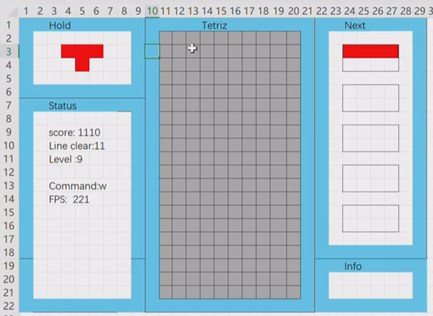
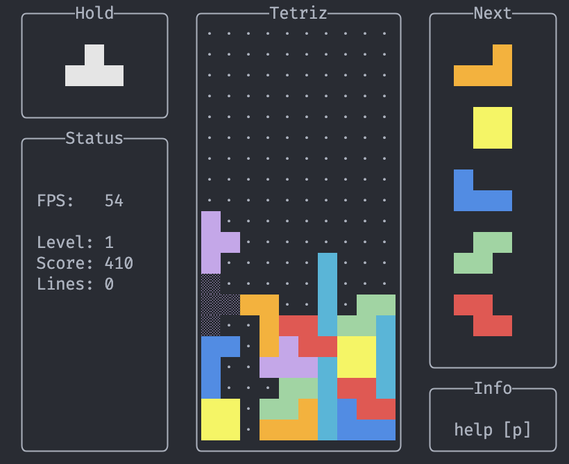
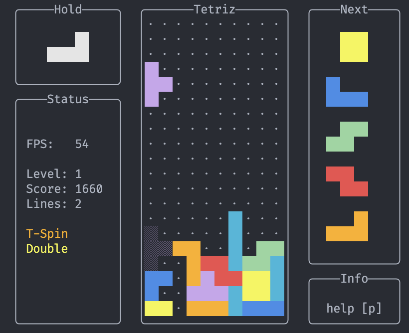
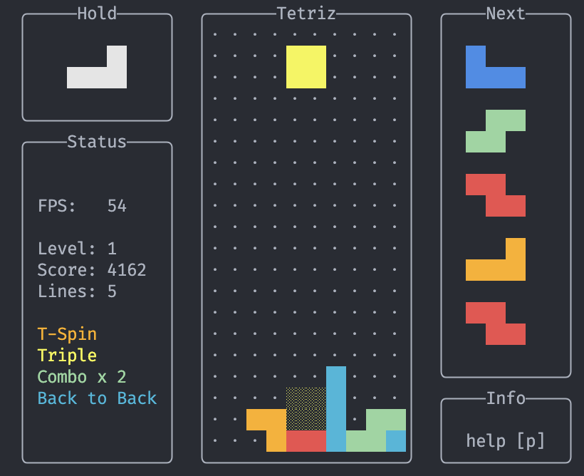

# Tetris

Vscode + Cmake + GCC

## 2 - Drawing on the Console

### ANSI Control Code

[ANSI](https://gist.github.com/fnky/458719343aabd01cfb17a3a4f7296797)

## 3 - MainLoop & Frame

ui: layout

dw: draw              gm: game logic  ut: utils

tc: terminal control

## 4 - UI



[Box Drawing Characters](https://en.wikipedia.org/wiki/Box-drawing_characters)

## 5 - Game Control & Keyboard Input

## 6 - Tetrimino & SRS

[TetrisWiki](https://harddrop.com/wiki/Tetromino)

## 6.1 - Offset Representation

[SRS](https://harddrop.com/wiki/SRS)
Allowing WallKick Table that follows it.

## 7 - Draw a frame

[Shadow Blocks](https://symbl.cc/en/unicode/blocks/geometric-shapes/)

## 8 - Performance Optimization

Draw background once
Add frame buffer & sstream buffer

40 fps -> 6600 fps

## 9 - Drop & Lock & Clear

Rotation Bug fixed

## 10 - Bag-7 Randomizer & Preview

[Randomizer History](https://simon.lc/the-history-of-tetris-randomizers)

## 11 - SRS & Wallkick

## 12 - Hold piece

[Hold piece](https://harddrop.com/wiki/Hold_piece)

## 13 - Scoring & Level up

[Scoring](https://harddrop.com/wiki/Scoring)

## 14 - Layout organization

---

## 15 - T-Spin

Update & Fix SRS
[T-spin](https://harddrop.com/wiki/T-Spin)

1. Tetromino being locked is T.
2. Last successful movement of the tetromino was a rotate, as opposed to sideways movement, downward movement, or falling due to gravity.
3. Three of the 4 squares diagonally adjacent to the T's center are occupied.

## 16 - Cross platform

Support Linux & MaxOS

Replace deprecated functions in C++20

```cpp
ramdom_shuffle -> shuffle
rand -> std::mt19937
```

## 17 - B2B & Combo

Fix T-spin check

[T-spin Detailed Explanation](https://www.reddit.com/r/Tetris/comments/b01hfm/comment/eic43sq/)

DT Cannon


