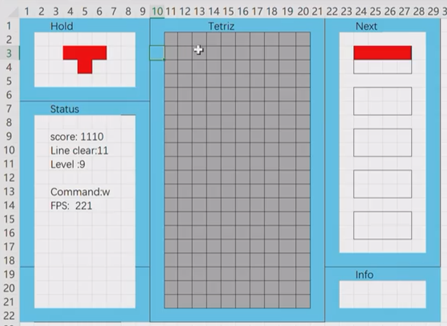

# Tetris
Vscode + Cmake + GCC 

## 2 - Drawing on the Console

### ANSI Control Code
[ANSI](https://gist.github.com/fnky/458719343aabd01cfb17a3a4f7296797)

## 3 - MainLoop & Frame 
ui: layout

dw: draw              gm: game logic  ut: utils

tc: terminal control 

## 4 - UI

[Box Drawing Characters](https://en.wikipedia.org/wiki/Box-drawing_characters)

## 5 - Game Control & Keyboard Input

## 6 - Tetrimino & SRS
[TetrisWiki](https://harddrop.com/wiki/Tetromino)